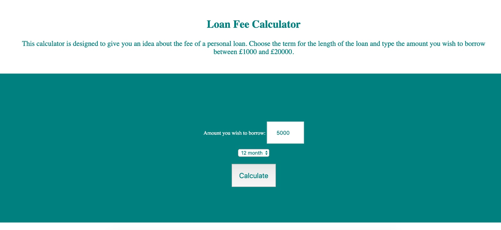
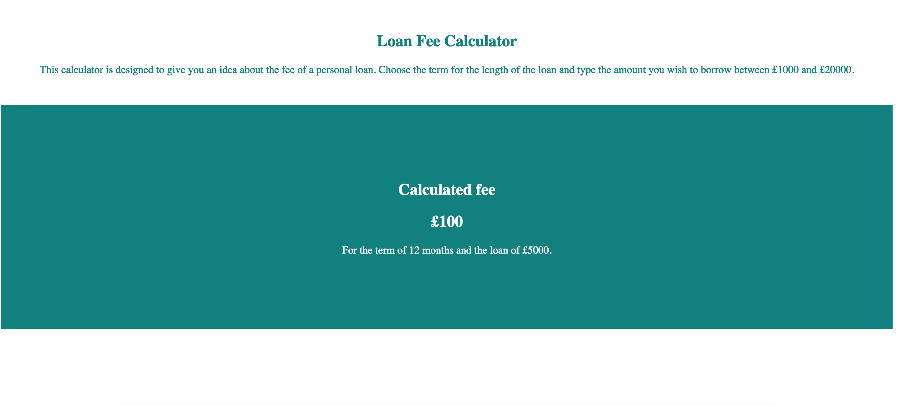

# Loan fee calculator

The aim of the project is creating a Loan fee calculator wrapped in a flask application.

## [Creating the calculator algorithm](https://github.com/Klariss/fee_calculator/blob/master/fee_calc/calculator.py)

The Fee Calculator which calculates fees according to a given
fee structure, values in between the breakpoints are interpolated linearly between the
lower bound and upper bound that they fall between. 
The minimum amount for a loan is the lowest value of the given fee structure, and the maximum is the highest value of the fee structure. The term can be either 12 or 24 (number of months).

The given fee structure is loaded into a CSV file.

[Finally testing the calculator.](https://github.com/Klariss/fee_calculator/blob/master/fee_calc/testing.py)

## [Wrapping the calculator in a Flask application](https://github.com/Klariss/fee_calculator/blob/master/fee_calc/flask_calc.py)

### The layout of the Fee calculator 

The layout was created by using HTML and CSS.
[Render a template when the route is triggered with GET method](https://github.com/Klariss/fee_calculator/blob/master/fee_calc/templates/index.html)

[Read form inputs and calculate the fee if route is triggered with POST](https://github.com/Klariss/fee_calculator/blob/master/fee_calc/templates/calculate.html)

